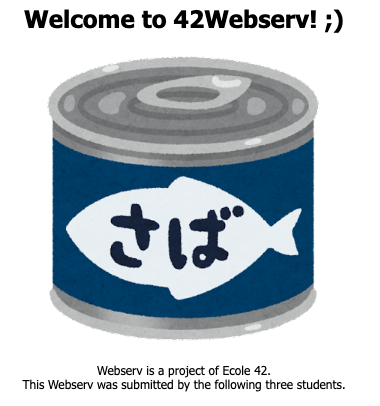
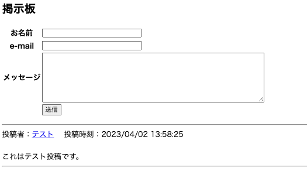

# 42 Webserv

このプロジェクトでは、HTTP/1.1に準拠したNginxライクなHTTPサーバーをC++で実装しました。  
42東京の[mkamei](https://github.com/Masaya-Kamei), kfumiya, [tsekiguc](https://github.com/TaiyouSekiguchi)による共同開発です。

## 概要

HTTP/1.1に準拠したNginxライクなHTTPサーバー

- シングルスレッドで、I/O(`socket`,`file`) が入出力可能になると発火するイベント駆動型
- HTTPリクエストを解析して、HTTPメソッドを実行し、HTTPレスポンスを作成して送る
- 対応メソッド: `GET`,`POST`,`DELETE`
- CGI 使用可能
- チャンク化転送符号法でのリクエストに対応
- 設定ファイルを読み込み可能
- C++98 で実装。

## ダウンロード＆ビルド＆実行

```sh
# クローン
git clone https://github.com/Masaya-Kamei/webserv.git

cd webserv

# コンパイル
make

# 実行
./webserv conf/default.conf
```

## 実行例

### GET

```sh
curl -v -X GET http://localhost:8080
```

### POST

```sh
curl -v -X POST -d "Hello, Webserv\!\!" http://localhost:8080/upload/
```

### DELETE

```sh
curl -v -X DELETE http://localhost:8080/sub2/sub2.html
```

### ブラウザでのデモ

[デモページ(http://localhost:8080/welcome.html)](http://localhost:8080/welcome.html)  
  
[掲示板(http://localhost:8080/cgi-bin/bbs.cgi)](http://localhost:8080/cgi-bin/bbs.cgi)  


## 設定ファイル

### Server Directive

| Directive                      | デフォルト | 説明                                       |
| ------------------------------ | ---------- | ------------------------------------------ |
| listen [address=*][:][port=80] | *:8000     | IPとポートを指定                           |
| server_name name ...           | ""         | サーバ名を指定                             |
| error_page code uri            | -          | ステータスコードに応じてエラーページを指定 |
| client_max_body_size size      | 1m         | リクエストの最大ボディサイズを指定         |
| location uri {}                | -          | location directiveを設定                   |

### Location Directive

| Directive                          | デフォルト | 説明                                 |
| ---------------------------------- | ---------- | ------------------------------------ |
| root path                          | html       | rootパスを指定                       |
| index file ...                     | index.html | indexファイルの指定                  |
| return [code=302] [URL=""]         | -          | リダイレクト先の指定                 |
| autoindex on/off                   | off        | autoindex のon off                   |
| allowed_methods method ...         | GET        | 使用できるメソッドの指定             |
| upload_root path                   | html       | ファイルアップロードのrootパスを指定 |
| cgi_enable_extension extension ... | cgi        | CGIで使用できる拡張子の指定          |

## キーワード

`C++`,`nginx`,`HTTPリクエスト`,`HTTPメソッド`,`HTTPレスポンス`,`I/O多重化`,`CGI`,`socket通信`,`Google Test`
